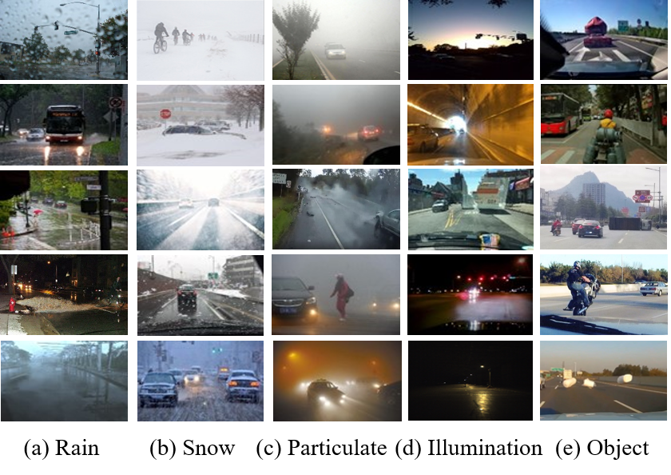
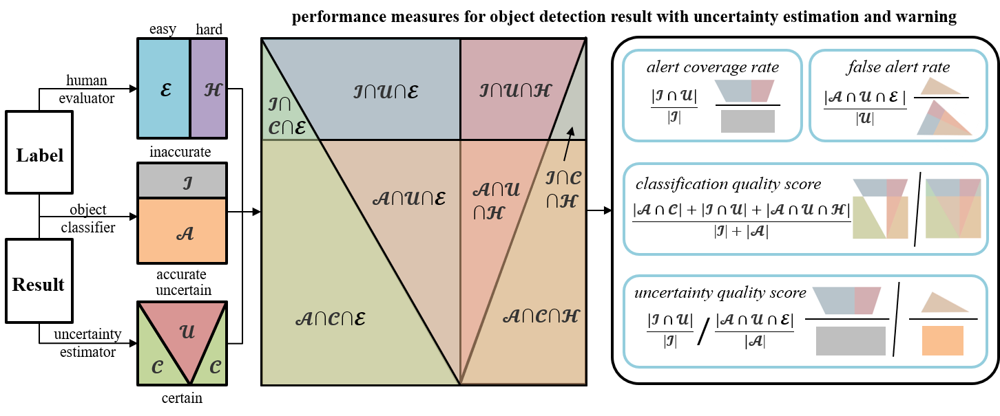
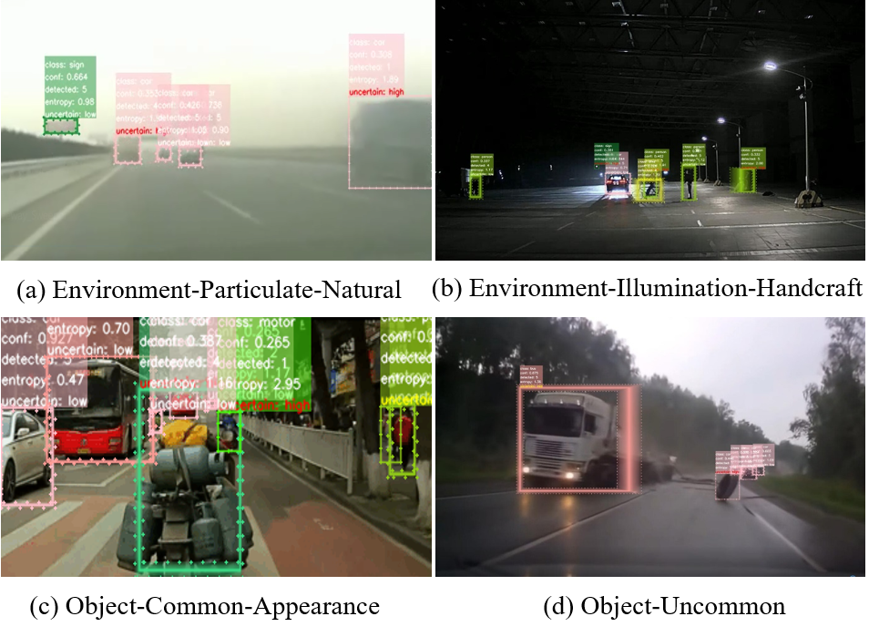

# PeSOTIF
## Introduction
The first batch of the PeSOTIF dataset includes 1126 frames of data that covers different weather, seasons, and times of the day. This work labeled 11 categories of traffic participants, including car, bus, truck, train, bike, motor, person, rider, traffic sign, traffic light, and traffic cone.   
In the YOLO format, each frame of image has a <kbd>.txt</kbd> file to store its annotations. Besides, the dataset is also reorganized as the COCO format <kbd>.json</kbd> for quick use.    
In addition to the category and bounding box parameters, a binary factor has been added to the annotation of each object to indicate whether the object is safety critical in the scenario. The ability to recognize the key object in the keyframe may be reduced due to trigger conditions in the scenario. In summary, there are 2555 key objects and 2778 normal objects labeled.    

## Data collection
The PeSOTIF dataset aims to be a diverse test dataset for perception SOTIF problems currently, thus collects key frames of critical traffic scenarios extracted from multiple data sources. In the future, after collecting sufficient corner cases, decomposing a training dataset to improve the algorithm performance will be considered.  
The first part of the data comes from [experiments](https://ieeexplore.ieee.org/abstract/document/9827365) designed to study trigger conditions and performance boundaries under different rain intensity and illumination intensity in previous works. A FLIR color camera was used to collect the data. Model: GS3-U3-41C6C-C; CMOSISCMV4000-3E5; global shutter; gain: -7.742dB to 24dB; high dynamic range: cycle 4 gain and exposure presets; frequency: 90Hz; 4.1MP; image size: 2048×2048; lens: FA1215A; lens hFov: -53.6°-53.6°; lens vFov: -41.8°-41.8°; lens focal length: 12mm. About two frames in each group of experiments were extracted and added to the PeSOTIF dataset.   
The second part of the data comes from traffic accident videos. There are thousands of videos uploaded by the perception task group of the China SOTIF technical alliance. These videos were screened from road test data, public traffic accident databases, and even clips-sharing sites like YouTube. This work has browsed these videos, further filtered out the scenarios related to perception SOTIF problems. Then, the key frames that may cause perception failure and traffic accidents were located and added to the PeSOTIF dataset.    
In addition, we also carefully selected some images that meet our requirements from the test subset of the existing data sets, including [BDD100k](https://openaccess.thecvf.com/content_CVPR_2020/html/Yu_BDD100K_A_Diverse_Driving_Dataset_for_Heterogeneous_Multitask_Learning_CVPR_2020_paper.html), [COCO](https://link.springer.com/chapter/10.1007/978-3-319-10602-1_48), [KITTI](https://journals.sagepub.com/doi/full/10.1177/0278364913491297), [Raindrop](https://openaccess.thecvf.com/content_cvpr_2018/html/Qian_Attentive_Generative_Adversarial_CVPR_2018_paper.html), [ExDark](https://www.sciencedirect.com/science/article/abs/pii/S1077314218304296), [Radiate](https://ieeexplore.ieee.org/abstract/document/9562089), etc. For on-board traffic data sets, some scenarios affected by the perceptual trigger conditions were added to the PeSOITF dataset. For visual detection data sets under adverse environment, some outdoor data was extracted.      
The demonstration video `PeSOTIF.mp4` shows the basic information and work process of the dataset.    

## Evaluation protocol
For the probabilistic object detectors with the functions of uncertainty estimation, this work suggests an evaluation protocol for measuring the performance of the entropy-based warning mechanism, which aims to simulate the reaction of human drivers to high-risk objects in the scenario. The analysis is performed in three dimensions:    
First, the objects are classified as key or normal in terms of the human evaluation factor values in their annotations. Second, the results are judged as accurate or inaccurate based on their accordance with the ground-truth data. Third, the results are classified into certain or uncertain bins according to their entropy values and the threshold. Based on this scheme, four evaluation indicators are introduced in the protocol, and they are defined as follows:
*	Alert coverage rate (ACR): the ratio of the number of objects that have been warned to that of objects that should be warned; the higher the ratio is, the better the performance will be;
*	False alert rate (FAR): the ratio of the number of objects that have been warned but should not be warned to that of all warned objects; the lower the ratio is, the better the performance will be;
*	Classification quality score (CQS): the results consistent with the meaning of classification dimension and uncertainty dimension; the larger the score is, the better the performance will be;
*	Uncertainty quality score (UQS): has the similar meaning as CQS; the higher the proportion of high-uncertainty objects in inaccurate results is, and the lower the proportion of high-uncertainty objects in accurate results is, the larger the UQS value will be, and the better the performance will be.

## Applications based on this dataset
Our team has trained and validated multiple 2D object detection networks on [BDD100k](https://openaccess.thecvf.com/content_CVPR_2020/html/Yu_BDD100K_A_Diverse_Driving_Dataset_for_Heterogeneous_Multitask_Learning_CVPR_2020_paper.html) and [traffic_cone](https://github.com/MarkDana/RealtimeConeDetection) datasets through transfer learning, and then tested them on our PeSOTIF dataset.   
Besides, we constructed a probabilistic object detector based on YOLOv5 using the deep ensembles method. The experimental results can be found in the [paper](https://arxiv.org/abs/2211.03402). Some detection results are shown as follows, where high-uncertainty objects should be along with the key objects annotated by human drivers.    

## Access
You can get the project and some samples by executing `git clone https://github.com/SOTIF-AVLab/PeSOTIF.git`. To access the full dataset， please contact us by e-mail: hong_wang@mail.tsinghua.edu.cn    or    peng-l20@mails.tsinghua.edu.cn   
* The title of the email should be: __\[Apply for PeSOTIF\] name\_country(region)\_organization__    
Please describe your laboratory or department, research interest, and the purpose of the dataset in detail in the email content; After confirmation, we will send the complete data link as soon as possible. You are also welcome to further communicate with us.    

## Citation
If you find our dataset useful in your work, please kindly cite us:   
* [PeSOTIF: a Challenging Visual Dataset for Perception SOTIF Problems in Long-tail Traffic Scenarios](https://ieeexplore.ieee.org/abstract/document/10186651/)    
* [Uncertainty Evaluation of Object Detection Algorithms for Autonomous Vehicles](https://link.springer.com/article/10.1007/s42154-021-00154-0)  
* [SOTIF Entropy: Online SOTIF Risk Quantification and Mitigation for Autonomous Driving](https://ieeexplore.ieee.org/abstract/document/10285374/)    
* [Safety Decision of Running Speed Based on Real-time Weather](https://ieeexplore.ieee.org/abstract/document/9827365)    

## Acknowledgements
We would like to appreciate the contributions of the perception task group of the CAICV-SOTIF technical alliance in China.   
Our training and testing codes applying our PeSOTIF dataset are built upon the following projects and papers:   
* [You Only Look Once v5](https://github.com/ultralytics/yolov5)
* [Open MMLab Detection Toolbox and Benchmark](https://arxiv.org/abs/1906.07155)    
* [Simple and scalable predictive uncertainty estimation using deep ensembles](https://proceedings.neurips.cc/paper/2017/hash/9ef2ed4b7fd2c810847ffa5fa85bce38-Abstract.html)
* [Evaluating merging strategies for sampling-based uncertainty techniques in object detection](https://ieeexplore.ieee.org/abstract/document/8793821)

## Organization

- School of Vehicle and Mobility, Tsinghua University
- Tsinghua Intelligent Vehicle Design and Safety Research Institute
- Safety Of The Intended Functionality（SOTIF） Research Team

